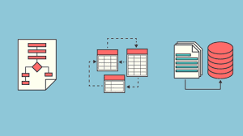

# Estructura de datos
En este repositorio podras encontrar temas relacionados con estructuras de datos implementadas en **JAVA**
1. Tipos de datos abstractos
2. Recursividad
3. Arreglos
4. Genericos
5. listas
6. Pilas
7. colas
8. Metodos ordenados y busqueda
9. Arboles

